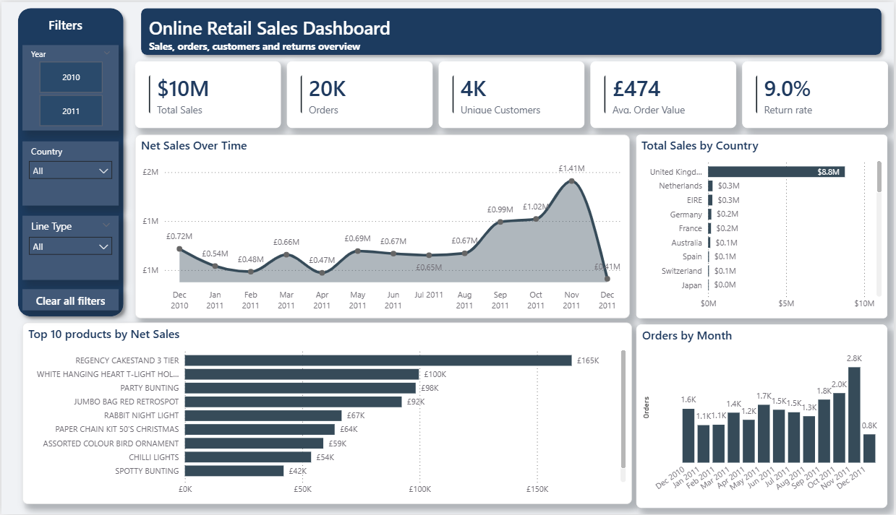
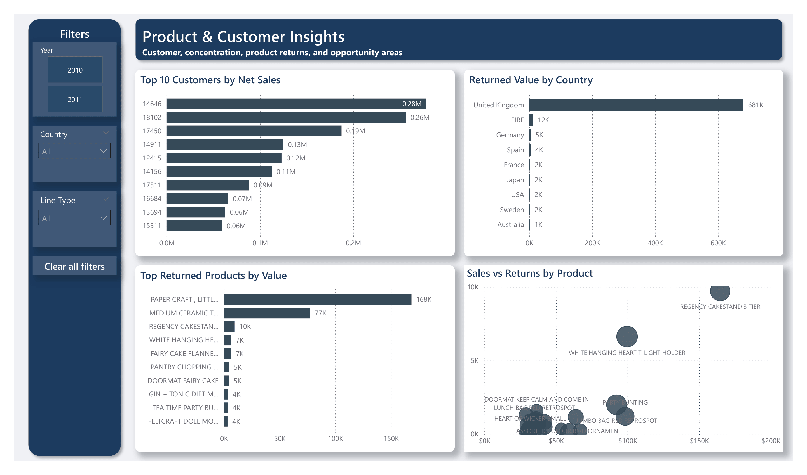

[English](README.md) | Español

# Análisis de Ventas de Retail Online del Reino Unido

## Resumen

Este proyecto explora el desempeño de ventas, el comportamiento de clientes, la demanda de productos y las
devoluciones mediante datos transaccionales de una empresa de retail online del Reino Unido. Demuestra un flujo de
business intelligence: inspeccionar datos de origen, clasificar líneas de transacción, modelar medidas temporales
y comunicar el análisis mediante un reporte de Power BI de dos páginas.

El repositorio permite revisar el **enfoque analítico y el diseño del dashboard**. Incluye el dataset original de
Excel, documentación de limpieza y del modelo, y capturas del reporte. **Actualmente no contiene un reporte de
Power BI que pueda abrirse:** el archivo `powerbi/online-retail-sales-analysis .pbix` versionado es un marcador de
posición de dos bytes. Las capturas son evidencia visual, no un dashboard interactivo.

## Cómo Usarlo

1. **Explorar el reporte:** revisar las dos [capturas del dashboard](#vista-previa-del-dashboard). No hace falta
   instalar software para verlas en GitHub.
2. **Inspeccionar la fuente:** abrir o descargar [Online Retail.xlsx](data/raw/Online%20Retail.xlsx) con una
   aplicación de hojas de cálculo compatible. El dataset incluye cancelaciones, cantidades negativas,
   identificadores de cliente faltantes y códigos especiales.
3. **Entender la preparación:** leer las [notas de limpieza](docs/cleaning-notes.md) sobre clasificación de
   líneas y decisiones de preparación.
4. **Interpretar el modelo:** consultar el [diccionario de datos](data/data-dictionary.md) para los nombres de
   campos, reglas de inclusión, medidas y KPIs documentados.

Power BI Desktop corresponde al flujo de trabajo original, pero el `.pbix` versionado no puede abrirse ni
actualizarse. Para reproducir el reporte interactivo se necesita un archivo válido o reconstruirlo por separado;
este repositorio no proporciona un procedimiento ejecutable completo.

## Vista Previa del Dashboard

Estas capturas muestran el diseño del reporte original de dos páginas. Sus métricas no están publicadas aquí como
resultados numéricos verificados de forma independiente.

### Sales Overview



La página ejecutiva reúne ventas, pedidos, clientes únicos, valor promedio por pedido, tasa de devolución, ventas
netas en el tiempo, desempeño por país, los diez productos principales por ventas netas y volumen mensual de
pedidos.

### Product & Customer Insights



La segunda página compara los diez clientes principales por ventas netas, valor devuelto por país, productos con
mayor valor de devoluciones y ventas frente a devoluciones por producto.

El reporte documenta los filtros **Year**, **Country** y **Line Type**. Para interactuar con ellos se necesita el
reporte original; las capturas almacenadas son estáticas.

## Preguntas de Negocio

El análisis se diseñó para explorar:

- ¿Cómo cambian las ventas y el volumen de pedidos con el tiempo?
- ¿Qué productos y clientes aportan más ventas netas?
- ¿Qué países concentran pedidos y valor devuelto?
- ¿Cómo varían las devoluciones entre productos y países?
- ¿Cómo evoluciona el valor promedio por pedido?

Estas son preguntas que el dashboard busca investigar, **no hallazgos verificados de forma independiente**. No
deben confundirse posibles patrones de concentración o devoluciones con resultados medidos sin disponer del
reporte o analizar los datos de origen.

## Herramientas Utilizadas

- **Excel:** inspección inicial de los datos.
- **Power Query:** preparación, clasificación y transformación documentadas.
- **Power BI / DAX:** modelo de datos, medidas y visualizaciones documentados.

## Dataset

La fuente versionada es [`data/raw/Online Retail.xlsx`](data/raw/Online%20Retail.xlsx). Sus campos de transacción
incluyen identificadores y fechas de factura, códigos y descripciones de productos, cantidades, precios unitarios,
identificadores de clientes y países.

La fuente es el dataset **Online Retail** publicado por UCI Machine Learning Repository y creado por Daqing Chen.
UCI lo identifica como 541,909 transacciones entre el 1 de diciembre de 2010 y el 9 de diciembre de 2011 de una
empresa de retail online registrada en el Reino Unido y sin tienda física.

**Cita del dataset:** Chen, D. (2015). *Online Retail* [Dataset]. UCI Machine Learning Repository.
https://doi.org/10.24432/C5BW33

El dataset está licenciado bajo **Creative Commons Attribution 4.0 International (CC BY 4.0)**. La copia incluida
en este repositorio conserva esa licencia; consultar [Licencia y atribución del dataset](DATA_LICENSE.md).

Las cancelaciones, cantidades negativas, IDs de cliente vacíos y códigos especiales requieren tratamiento distinto
según la métrica. Las [notas de limpieza](docs/cleaning-notes.md) explican las decisiones; el
[diccionario de datos](data/data-dictionary.md) recoge los campos y reglas documentados.

## Limpieza y Preparación de Datos

El flujo documentado estandariza tipos de datos, identifica cancelaciones y devoluciones, distingue productos de
vouchers de regalo y ajustes, revisa valores faltantes y prepara una tabla calendario para reportes temporales.

La regla principal, `Include_In_Main_Analysis`, limita las ventas principales a líneas **Product** normales, no
canceladas, con cantidad no negativa y precio distinto de cero. Las devoluciones se analizan por separado. Para
las clasificaciones y reglas completas, consultar el
[diccionario de datos](data/data-dictionary.md#business-rules-for-calculated-columns).

## Modelo de Datos

El modelo documentado consta de una tabla transaccional **Online Retail** y una tabla de fechas **Calendar**
basada en `Invoice_Day`.

Las medidas abarcan ventas principales y netas, pedidos, clientes únicos, valor promedio por pedido, valor
devuelto y tasa de devolución. La referencia autoritativa del modelo *documentado* es el
[diccionario de campos y medidas](data/data-dictionary.md); no pueden verificarse de forma independiente frente al
PBIX de marcador de posición.

## Mapa de Documentación

| Si quieres… | Consulta… |
| --- | --- |
| Ver cómo era el reporte | [Sales Overview](dashboard/sales-overview.png) o [Product & Customer Insights](dashboard/product-customer-insights.png) |
| Examinar los datos originales | [Online Retail.xlsx](data/raw/Online%20Retail.xlsx) |
| Entender decisiones y supuestos de limpieza | [Notas de limpieza](docs/cleaning-notes.md) |
| Buscar campos, clasificaciones o medidas | [Diccionario de datos](data/data-dictionary.md) |
| Verificar procedencia y condiciones de reutilización del dataset | [Licencia y atribución del dataset](DATA_LICENSE.md) |

Las rutas principales almacenadas son:

```text
README.md
README.es.md
LICENSE
DATA_LICENSE.md
dashboard/
  sales-overview.png
  product-customer-insights.png
data/
  raw/Online Retail.xlsx
  data-dictionary.md
docs/
  cleaning-notes.md
powerbi/
  online-retail-sales-analysis .pbix   # marcador de dos bytes; no ejecutable
```

## Estado del Proyecto

El repositorio documenta un **ejercicio de análisis y diseño de dashboard completado** mediante descripciones y
capturas. Sin embargo, **no incluye una entrega de Power BI ejecutable**: el único `.pbix` versionado es un
marcador de posición y los pasos entre la fuente y el reporte se describen conceptualmente, no como un pipeline
completo ejecutable.

Esta distinción conserva la evidencia disponible sin sugerir que el dashboard interactivo pueda reproducirse
directamente con los archivos versionados.

## Licencia

Los materiales originales del proyecto incluidos en este repositorio se publican bajo la [Licencia MIT](LICENSE).

El dataset de origen **no se relicencia bajo MIT**. `data/raw/Online Retail.xlsx` corresponde al dataset
**Online Retail** de UCI, creado por Daqing Chen, y conserva su licencia **CC BY 4.0**. La atribución y las
condiciones de reutilización se documentan en [DATA_LICENSE.md](DATA_LICENSE.md).

## Autor

**Angel W. Miller** — Junior Data Analyst enfocado en business intelligence, analytics y desarrollo de dashboards.

## Contacto

- GitHub: [angel-wm](https://github.com/angel-wm)
- LinkedIn: [Angel W. Miller](https://www.linkedin.com/in/angel-w-miller/)
