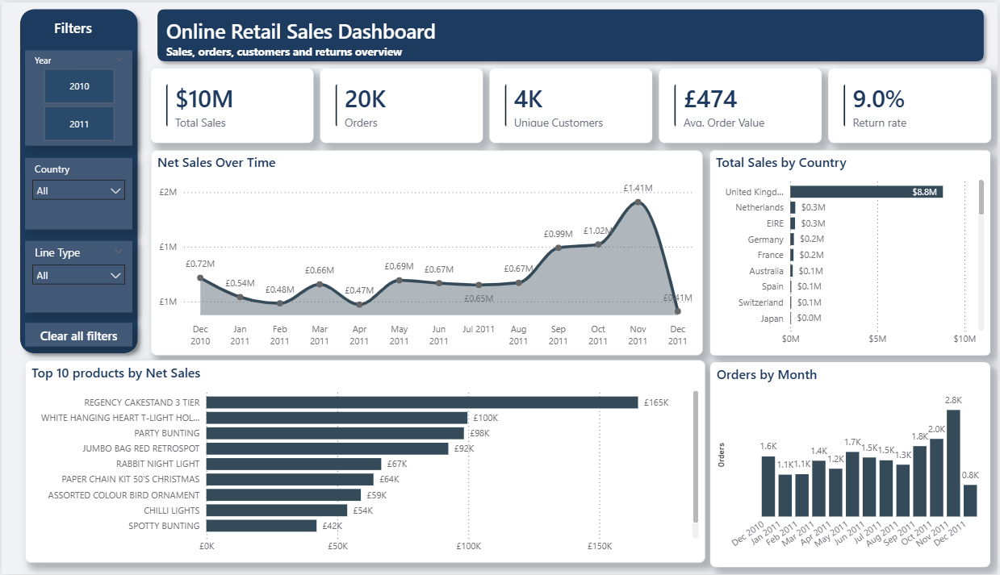
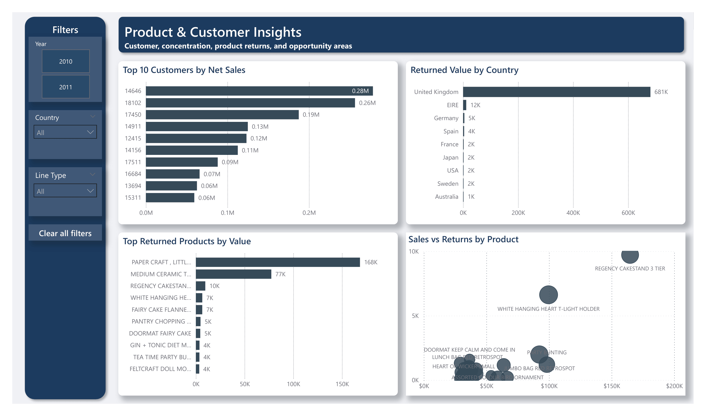

English | [Español](README.es.md)

# UK Online Retail Sales Analysis

## Overview
This project analyzes transactional data from a UK-based online retail business to uncover trends in sales performance, customer behavior, product demand, and returns.

The final output is a two-page interactive **Power BI dashboard** built on a cleaned and transformed dataset. The project combines data cleaning, modeling, DAX measures, and dashboard design to turn raw retail transactions into business-ready insights.

## Dashboard Preview

### Sales Overview


### Product & Customer Insights


## Business Questions
This project is designed to answer questions such as:
- How are sales evolving over time?
- Which products generate the highest sales?
- Which countries contribute the most orders and returned value?
- What is the return rate across products and countries?
- How do order volume and average order value behave over time?
- Which customers generate the highest net sales?

## Tools Used
- **Excel** – initial data inspection
- **Power Query** – data cleaning and transformation
- **Power BI** – data modeling, DAX measures, and dashboard development

## Dataset
The dataset contains transaction-level retail data, including:
- Invoice / order identifiers
- Product codes and product descriptions
- Quantities sold or returned
- Unit price
- Customer identifiers
- Country
- Transaction date

> Note: The dataset includes cancellations, returns, missing customer IDs, and non-product or special-code records, so a significant part of the project focused on data cleaning and classification.

## Data Cleaning and Preparation
Key preparation steps included:
- Standardizing data types
- Identifying cancelled invoices
- Flagging returned transactions
- Separating valid product records from non-product or special codes
- Handling missing values
- Creating business logic and data quality flags
- Building a calendar table for time-based analysis
- Creating time fields for monthly and yearly reporting

## Data Model
The Power BI model is built around an **Online Retail** transactional table connected to a **Calendar** table to support monthly and yearly trend analysis.

Additional calculated columns and measures were created to evaluate:
- Main Sales
- Net Sales
- Orders
- Unique Customers
- Average Order Value
- Return Value
- Return Rate

## Dashboard Structure
The report is organized into two pages:

### 1. Sales Overview
This page provides a high-level summary of business performance through KPI cards and trend visuals. It includes:
- Sales KPI
- Orders
- Unique Customers
- Average Order Value
- Return Rate
- Net Sales Over Time
- Sales by Country
- Top 10 Products by Net Sales
- Orders by Month

### 2. Product and Customer Insights
This page focuses on customer value, product returns, and comparative analysis. It includes:
- Top 10 Customers by Net Sales
- Returned Value by Country
- Top Returned Products by Value
- Sales vs Returns by Product

## Filters
The dashboard includes interactive filters for:
- **Year**
- **Country**
- **Line Type**

## Key Insights
This dashboard helps identify patterns such as:
- A small group of products may account for a large share of total sales.
- Some countries may generate strong order volume while also showing high returned value.
- Return behavior can vary significantly by product.
- Net sales and order trends can shift meaningfully across months.
- Customer contribution is concentrated among a relatively small number of buyers.

## Files in This Repository
- `README.md` – English project documentation
- `README.es.md` – Spanish project documentation
- `dashboard/` – dashboard screenshots or exported visuals
- `powerbi/` – Power BI project file
- `docs/` – supporting notes, definitions, or project documentation
- `data/` – optional supporting files such as a data dictionary

## Recommended Repository Structure
```text
online-retail-sales-analysis/
│
├── README.md
├── README.es.md
├── dashboard/
│   ├── sales-overview.png
│   └── product-customer-insights.png
├── docs/
│   └── cleaning-notes.md
├── data/
│   └── data-dictionary.md
└── powerbi/
    └── online-retail-sales-analysis.pbix
```

## How to Use
1. Download or open the `.pbix` file from the `powerbi/` folder.
2. Open the file in Power BI Desktop.
3. Refresh the data source if needed.
4. Use the filters to explore performance by year, country, and line type.
5. Review both report pages to compare sales, orders, customers, and returns.

## Project Status
This project is complete and showcases an end-to-end retail sales analysis workflow, from data cleaning and preparation to dashboard design and business insight generation.

## Author
**Angel W. Miller**  
Junior Data Analyst focused on business intelligence, analytics, and dashboard development.

## Contact
- GitHub: [angel-wm](https://github.com/angel-wm)
- LinkedIn: [Angel W. Miller](https://www.linkedin.com/in/angel-w-miller/)
