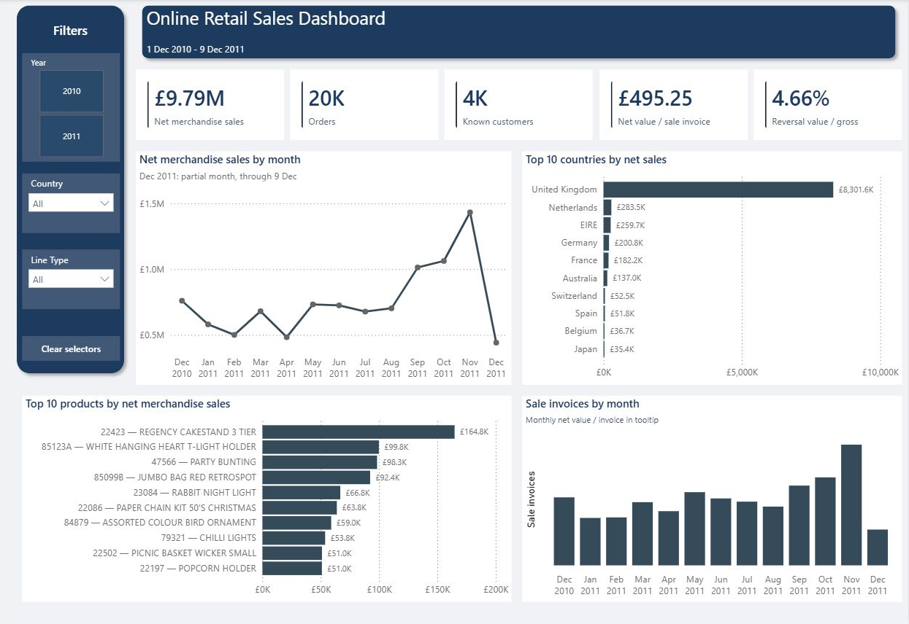
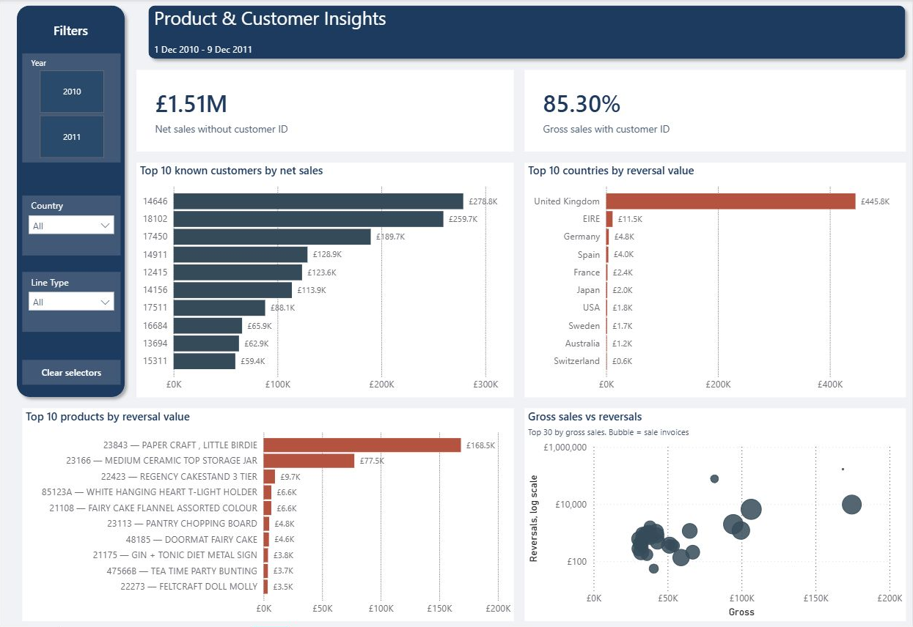

English | [Español](README.es.md)

# UK Online Retail Sales Analysis

A two-page Power BI project for exploring merchandise sales, customer coverage and cancellation/reversal value in the UCI Online Retail dataset. It includes the original Excel source, editable report and model definitions, and reproducible financial checks.

**Start with [opening the project](docs/SETUP.md).** For source-controlled development, open the [PBIP project](uk-online-retail-sales-analysis.pbip) in the repository root. For a single-file Desktop copy, open the [PBIX export](exports/uk-online-retail-sales-analysis.pbix). The PBIP and its TMDL/PBIR definitions remain the maintained source of truth.

Amounts are in **GBP (£)**, the source currency. The data covers **1 December 2010–9 December 2011**: 2010 contains only December, and December 2011 is incomplete. Negative transactions identify recorded reversals; they do not establish physical returns or customer dissatisfaction.

## Open and explore

1. Clone or download the complete repository, including `powerbi/` and `data/raw/`.
2. Follow the [setup procedure](docs/SETUP.md) to configure the Excel location and open the root PBIP in Power BI Desktop.
3. Refresh the model, then explore **Sales Overview** and **Product & Customer Insights**. Year, Country and Line Type selectors are synchronized across pages.

Power BI Desktop on Windows is required for the interactive report. Python and .NET are only needed for the optional [validation workflow](docs/VALIDATION.md#run-source-and-static-checks).

## Dashboard preview

Both images were captured from the current report in Power BI Desktop on 10 October 2026, with both years included, Country and Line Type set to All, and no selected chart marks.

### Sales Overview

The overview combines net merchandise sales, sale invoices, known customers, net value per sale invoice and reversal value relative to gross sales. The monthly chart identifies December 2011 as a partial month.

### Product & Customer Insights

The insights page shows customer coverage and rankings by net sales or reversal value. The scatter plot compares gross sales with reversals for the top 30 products by gross sales. Its vertical axis is logarithmic; bubble size represents sale invoices.

These images show the rendered pages. They are separate from the numerical and interaction checks described in [Validation](docs/VALIDATION.md).

## Read next

| Your task | Reference |
| --- | --- |
| Open, configure or troubleshoot the report | [Setup](docs/SETUP.md) |
| Interpret sales, reversals and customer coverage | [Metrics](docs/METRICS.md) |
| Understand tables, relationships and product identity | [Model](docs/MODEL.md) |
| Look up fields and classification rules | [Data dictionary](data/data-dictionary.md) |
| Understand source preparation and retained limitations | [Cleaning notes](docs/cleaning-notes.md) |
| Repeat checks and understand their scope | [Validation](docs/VALIDATION.md) |
| Find files and distinguish local generated content | [Project structure](docs/PROJECT_STRUCTURE.md) |

## Source and license

The versioned source is [Online Retail.xlsx](data/raw/Online%20Retail.xlsx), containing 541,909 transaction lines. It is preserved without edits. The model retains 540,455 lines after the documented null-description exclusion and keeps repeated transaction lines.

**Dataset citation:** Chen, D. (2015). *Online Retail* [Dataset]. UCI Machine Learning Repository. [DOI: 10.24432/C5BW33](https://doi.org/10.24432/C5BW33).

The dataset remains under **CC BY 4.0**; see [dataset attribution and license](DATA_LICENSE.md). Repository-authored materials use the [MIT License](LICENSE).

Created by [Angel W. Miller](https://github.com/angel-wm).
